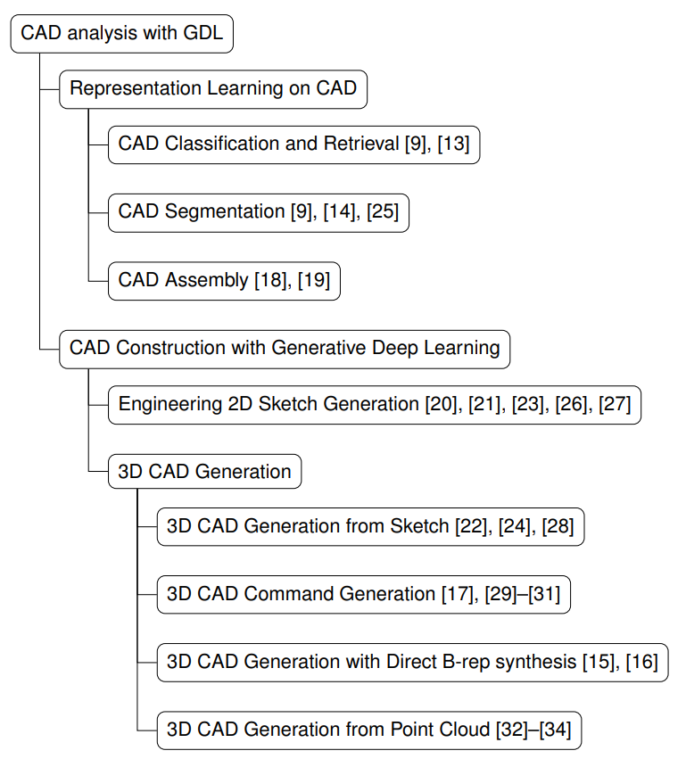

# awesome-CAD-Generation
A curated list of CAD Generation papers, inspired by [Awesome-AIGC-3D](https://github.com/hitcslj/Awesome-AIGC-3D).

from [Geometric Deep Learning for Computer-Aided Design: A Survey](https://arxiv.org/abs/2402.17695).

## Table of Contents

- [Survey](#survey) 
- [Papers](#papers)
- [Benchmarks and Datasets](#Benchmarks-and-Datasets)
- [Company](#company)

## Survey
- [Geometric Deep Learning for Computer-Aided Design: A Survey](https://arxiv.org/abs/2402.17695v1)
- [3D Generative Models: A Survey](https://arxiv.org/abs/2210.15663)
- [Advances in 3D Generation: A Survey](https://arxiv.org/abs/2401.17807)
- [MLCAD: A Survey of Research in Machine Learning for CAD Keynote Paper](https://doi.org/10.1109/TCAD.2021.3124762)

## Papers
-[CAD-LLM: Large Language Model for CAD Generation](https://www.research.autodesk.com/publications/ai-lab-cad-llm/)
-[SketchGen: Generating Constrained CAD Sketches](https://arxiv.org/abs/2106.02711)
- [MeshAnything: Artist-Created Mesh Generation with Autoregressive Transformers](https://arxiv.org/abs/2406.10163)
- [SolidGen: An Autoregressive Model for Direct B-rep Synthesis](https://arxiv.org/abs/2203.13944)
- [BrepGen: A B-rep Generative Diffusion Model with Structured Latent Geometry](https://arxiv.org/abs/2401.15563)
- [Brep2Seq: a dataset and hierarchical deep learning network for reconstruction and generation of computer-aided design models](https://doi.org/10.1093/jcde/qwae005)
- [PlankAssembly: Robust 3D Reconstruction from Three Orthographic Views with Learnt Shape Programs](https://arxiv.org/abs/2308.05744)
- [UV-Net: Learning from Boundary Representations](https://arxiv.org/abs/2006.10211)

## Benchmarks and Datasets
- [ABC Dataset A Big CAD Model Dataset For Geometric Deep Learning](https://deep-geometry.github.io/abc-dataset/)
- [ShapeNet: An Information-Rich 3D Model Repository](https://arxiv.org/abs/1512.03012)
- [Objaverse: A Universe of 10M+ 3D Objects](https://objaverse.allenai.org/)
- [SketchGraphs: A Large-Scale Dataset for Modeling Relational Geometry in Computer-Aided Design](https://github.com/PrincetonLIPS/SketchGraphs)
- [Fusion 360 Gallery: A Dataset and Environment for Programmatic CAD Construction from Human Design Sequences](https://arxiv.org/abs/2010.02392)
- [DeepCAD: A Deep Generative Network for Computer-Aided Design Models](https://www.cs.columbia.edu/cg/deepcad/)

## Company
- [TRIPOAI](https://www.tripo3d.ai/)
- [LumaAI](https://lumalabs.ai/)
- [CSMAI](https://www.csm.ai/)
- [SUDOAI](https://www.sudo.ai/)
- [Meshy](https://www.meshy.ai/)
- [StabilityAI](https://stability.ai/)
- [AUTODESK](https://www.research.autodesk.com/)
